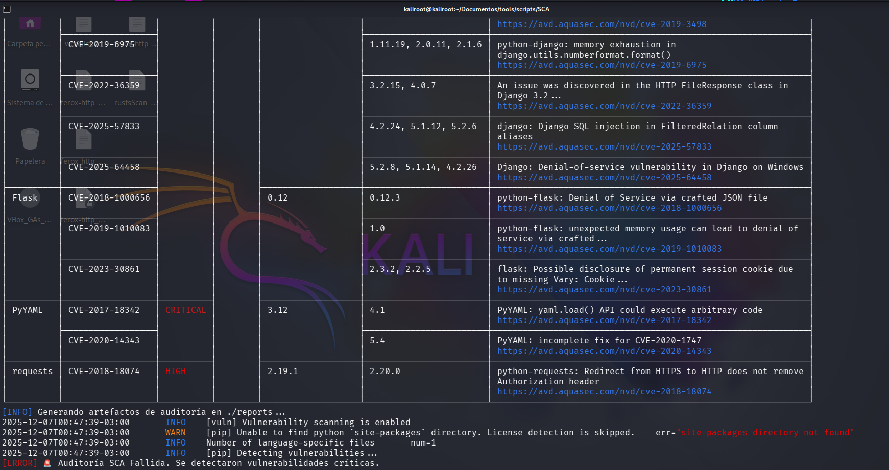

# Software Composition Analysis (SCA) - Motor de Detección

**Referencia:** T-13 

**Herramienta:** [Trivy](https://github.com/aquasecurity/trivy "null") (Aqua Security) 

**Versión Script:** 1.0 (Enterprise Wrapper) 

**Propósito:** Proveer un mecanismo automatizado para la detección temprana de vulnerabilidades y exposiciones comunes (CVEs) en dependencias de software y contenedores, cumpliendo con el requisito de "Análisis de Componentes" de OWASP Top 10.

## 1. Mecanismo de Ejecución y Lógica del Quality Gate

El script `scan-deps.sh` opera como un **Quality Gate de Seguridad** no bloqueante en local y bloqueante en CI/CD. Su flujo lógico es:

1. **Aprovisionamiento Automático:** Detecta la ausencia del binario `trivy` e inicia una instalación efímera (ideal para _runners_ de CI/CD limpios).
    
2. **Análisis Estático:** Inspecciona el sistema de archivos en busca de manifiestos de paquetes soportados.
    
3. **Filtrado de Ruido:** Aplica filtros estrictos para reportar únicamente vulnerabilidades de severidad **CRITICAL** y **HIGH**, reduciendo la fatiga de alertas.
    
4. **Generación de Evidencia:** Produce artefactos de auditoría en formatos estándar (`JSON`, `HTML`) en el directorio `./reports`.
    
5. **Decisión de Bloqueo:** Retorna un código de salida `1` (Error) ante hallazgos positivos, forzando la detención del _pipeline_ de despliegue.
    

## 2. Procedimiento de Validación Local (PoC)

Este procedimiento permite a los desarrolladores validar la seguridad de sus dependencias antes de realizar un _commit_.

### Requisitos del Entorno

- Sistema Operativo: Linux o MacOS (WSL soportado).
    
- Dependencias: `curl`.
    
- **Convención de Nombres:** Los archivos de manifiesto deben seguir los estándares de la industria para ser detectados.
    

### Matriz de Archivos Soportados

|Lenguaje/Tecnología|Archivos Esperados|
|---|---|
|**Python**|`requirements.txt`, `Pipfile.lock`|
|**Node.js**|`package.json`, `package-lock.json`|
|**Java**|`pom.xml`|
|**Go**|`go.mod`|
|**Contenedores**|`Dockerfile`|

### Ejecución del Escáner

```
# 1. Asignar permisos de ejecución
chmod +x scripts/sca/scan-deps.sh

# 2. Iniciar el motor de análisis
./scripts/sca/scan-deps.sh
```

### Interpretación de Resultados

En caso de fallo (vulnerabilidades detectadas), el sistema desplegará una tabla de hallazgos en la terminal:



## 3. Artefactos de Auditoría y Reportes

El motor genera evidencia persistente en la carpeta `reports/` con _timestamps_ únicos para trazabilidad:

- **`sca_report_*.json`**: Formato estructurado para la ingestión automática en plataformas de gestión de vulnerabilidades (ej. DefectDojo, SonarQube).
    
- **`sca_report_*.html`**: Reporte legible para revisión humana y cumplimiento de auditorías externas.
    

## 4. Integración en Pipeline CI/CD (GitHub Actions)

Para implementar el control **"Shift-Left"**, incorpore el siguiente _stage_ en el flujo de trabajo (`.github/workflows/pipeline.yml`). Esto garantiza que ningún código vulnerable sea fusionado a la rama principal.

```
jobs:
  security-gate:
    name: SCA Security Quality Gate
    runs-on: ubuntu-latest
    steps:
      - name: Checkout del Código Fuente
        uses: actions/checkout@v3

      - name: Ejecutar Motor SCA (Trivy Wrapper)
        run: |
          chmod +x scripts/sca/scan-deps.sh
          ./scripts/sca/scan-deps.sh
        
      - name: Archivar Evidencia de Auditoría
        if: always() # Garantizar la subida del reporte incluso en caso de fallo
        uses: actions/upload-artifact@v3
        with:
          name: sca-compliance-reports
          path: reports/
```

## 5. Diagnóstico y Resolución de Incidentes

**Incidente:** `[WARN] Supported files for scanner(s) not found`.

- **Causa Raíz:** Trivy no detecta archivos de configuración con nombres estándar.
    
- **Resolución:** Verificar que los manifiestos no tengan nombres personalizados (ej. cambiar `mis_libs.txt` a `requirements.txt`).
    

**Incidente:** Error `Rate Limit` al descargar la base de datos de vulnerabilidades.

- **Causa Raíz:** Múltiples ejecuciones desde una IP compartida sin autenticación.
    
- **Resolución:** Configurar la variable de entorno `TRIVY_GITHUB_TOKEN` con un Personal Access Token (PAT) válido en el entorno de CI/CD.
